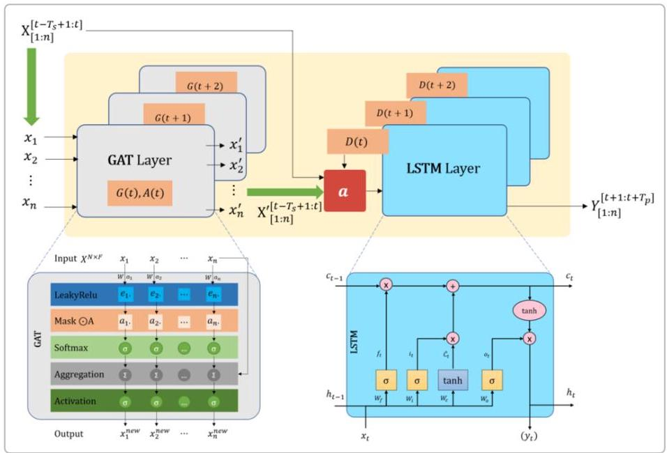

<!-- Meanless: § ChatGPT-->

## 基于时空表示学习的交通流量预测模型设计方案

## 模型整体架构描述

本模型针对城市道路传感器的交通流量数据,融合图神经网络和序列模型来同时建模空间和时间依赖关系 ${}^{1}$ 。具体而言,我们采用图注意力网络(Graph Attention Network, GAT)来提取道路拓扑间的空间相关特征,并采用长短期记忆网络(LSTM)来捕捉交通流量随时间变化的时序模式 2 。通过结合这两种模型,能够有效利用交通数据中的时空特性,从而比仅考虑单一维度的模型取得更好的预测精度 ${}^{3}$ 。

本方案选择串行架构将空间和时间建模过程整合,即先通过GAT模块对每个时间步的路网状态进行空间特征提取,再将提取的时空特征序列输入LSTM模块进行时间模式学习和预测。采用串行结构的原因在于：经过GAT的初步处理可以捕捉交通网络中有意义的邻接关系,为后续LSTM层提供丰富的上下文信息 4 。换言之,GAT对每个节点赋予的注意力权重反映了该节点交通状态的空间依赖程度,先融合这些空间依赖有助于LSTM更好地建模时间演化过程 4 。相较而言,并行架构则会分别提取空间和时间特征再融合,虽然也可行但增加了设计复杂度且可能在数据量有限(约50MB)时不易训练稳定。因此,我们采用串行时空建模以保证模型高效性和易训练性。

<!-- Media -->

<!-- figureText: ${}_{s}\left\lbrack  {t - {T}_{S} + 1 : t}\right\rbrack$ $D\left( {t + 2}\right)$ $D\left( t\right)$ LSTM Layer ${c}_{t - 1}$ $\left( {y}_{t}\right)$ ${\lambda }_{\left\lbrack  1 : n\right\rbrack  }$ $G\left( {t + 2}\right)$ $G\left( {t + 1}\right)$ $\bullet$  ${x}_{1}^{\prime }$ GAT Layer ${x}_{2}^{\prime }$ $G\left( t\right) ,A\left( t\right)$ ${X}^{\prime }\left\lbrack  {t - {T}_{S} + 1 : t}\right.$ Input ${X}^{N \times  F}$ $W{a}_{n}$ LeakyRelu Mask @A Softmax Aggregation Activation Output ${x}_{n}^{new}$ -->

图：GAT+LSTM串行融合的模型架构示意图。左下方展示了GAT层的计算过程：对每个时间步输入的图数据,先对邻居节点特征计算注意力分数(经过LeakyReLU激活并应用邻接掩膜),通过Softmax得到相邻节点权重, 将邻居特征加权聚合后得到中心节点的新的空间表征,并经过激活函数输出。右侧蓝色模块显示LSTM的内部结构：包括遗忘门\$f_t\$、输入门\$i_t\$、输出门\$o_t\$(σ表示Sigmoid激活,⊕表示逐元素操作)和细胞状态 $\$$ c_t $\$$ 的更新(tanh表示双曲激活)。在本模型中,每个历史时间 $\$ \mathrm{t}\$$ 的传感器流量向量先经过GAT层得到空间增强表示\$X'^\{[t]\}\$,然后作为后续LSTM编码器的输入序列。经过LSTM时序建模后,模型输出未来多个时间步的流量预测\$Y^\{[t+1:t+T_p]\}\$(如图右上所示序列输出)供下游使用。

<!-- Media -->

<!-- Meanless: 1-->

## 空间依赖建模：图注意力网络模块

功能：空间模块利用图注意力网络挖掘道路传感器之间的依赖关系。通过道路拓扑构建传感器节点图,GAT对每个节点和其邻居的特征进行加权聚合,突出对目标节点有重要影响的邻居信息 ${}^{5}$ 。这样能够动态地学习交通网络中不同路段间的关系权重,实现对交通状态在空间上传播的建模 ${}^{5}$ 。

结构：本模型的GAT模块由两层串联的图注意力层组成。第一层GAT接受每个时间步各传感器的流量特征向量, 计算该图上每条边的注意力系数并聚合邻居特征；第二层GAT进一步在上一层输出的基础上提炼更高阶的空间信息(捕捉两跳范围的邻居影响)。各层具体设计如下：

- 输入与邻接矩阵：设每个时间步传感器观测组成特征向量\$x^\{N\\times F\}\$(\$N\$为节点数量,\$F\$为每节点的特征维度,例如当前流量值)。GAT采用预定义的道路拓扑邻接矩阵\$A\$,其元素表示传感器之间的道路连接关系(例如基于道路距离或直接相连关系) 6 。本任务中使用METR-LA数据集提供的路网拓扑,该图较为稠密但整体结构在整个数据期间保持稳定 ${}^{6}$ 。

- 注意力计算：在GAT层中,每个节点\$i\$和邻居节点\$j\$的特征首先通过可学习的权重矩阵投影到隐藏空间,然后计算注意力打分：\$e_\{ij\} = \\text\{LeakyReLU\}\\big(a^T [W\\mathbf\{h\}i \\parallel W\\mathbf\{h\} _j]\\big)\$,其中\$\\parallel\$表示向量串联,\$a^T\$为注意力权重向量 7 。我们采用LeakyReLU激活 (负斜率例如0.1)以避免忽略负特征贡献 8 。接着对不相邻的节点屏蔽该打分(应用邻接Mask), 对每个节点归一化邻居\$j\$的注意力系数\$\\alpha\} = \\text\{softmaxj(e)\$ 7 。这样每个节点仅从相邻节点收集信息且权重和为1。

- 特征聚合：完成注意力系数计算后,每个节点从所有邻居收集加权特征：\$\\mathbf\{z\}i \\sigma\\Big(\\sum(i)\$为\$i\$的邻居集合,\$\\sigma\$为激活函数(如ReLU)。本模型中,\}(i)\} \\alpha_\{ij\} \\, W \\mathbf\{h\}_j\\\\Big)\$,其中\$\\mathcal\{N第一层GAT以每个传感器当前流量值作为输入特征(维度 \$F=1\$),输出每节点隐藏表示维度设为\$d_g=64\$；第二层GAT继续接受第一层输出(维度64)并输出维度仍为64的新的节点表示。每层的注意力头数可设为\$K=4\$(例如4头并行注意力)以获取多种关系模式,再将各头输出在特征维上拼接形成最终表示 7 。两层GAT均在输出处使用ReLU激活,并可加入 Dropout正则化(例如置0概率0.2)以防止过拟合。

- 输出：经过GAT模块后,每个时间步\$t\$都会得到一个包含所有节点更新特征的矩阵\$X'^\{[t]\} \\mathbb\{R\}^\{N \\times d_g\}\$,这就是融合了空间邻居信息的节点状态表示。对于输入的连续12个历史时间步,我们会对每一时刻分别通过共享参数的GAT层进行上述计算,得到长度为12的空间特征序列\$ \{X'^\{[t-T_h+1]\},...,X'^\{[t]\}\}\$,其中\$T_h=12\$为历史序列长度。

## 时间依赖建模：LSTM序列模块

功能：时间模块采用长短期记忆网络(LSTM)对每条道路的流量随时间的变化进行建模2。LSTM通过门控循环单元能够记忆长期依赖并过滤无关信息,非常适合捕捉交通流量随时间的周期性、趋势性等动态特征。该模块根据输入的空间特征序列,预测未来多个时间步的流量值。

结构：为了实现多步预测,我们使用编码器-解码器架构的LSTM网络来建模时间依赖,包括一个LSTM编码器和一个LSTM解码器：

- 编码器LSTM：编码器接收由GAT模块生成的长度为12的空间特征序列\$\{X'^\{\{t-11\}\},...,X'^\{[t]\}\}\$作为输入。对于每一个传感器节点,我们将其在这12个时间步的GAT特征(维度\$d_g=64\$)当作一个时间序列输入同一个LSTM单元进行处理(可将节点维度当作批次维度,从而多个节点共享LSTM参数)。编码器 LSTM逐步阅读12个历史时间步,在每一步更新其隐藏状态\$h_t\$和细胞状态\$c_t\$。LSTM隐藏层维度可设为 $\$ \mathrm{d}\_ \mathrm{h} = {64}\$$ ,与GAT输出维度一致以方便连接。经过12步后,编码器在时间 $\$ \mathrm{t}\$$ 产生的隐藏状态 \$h_\{t\}\$可以被看作是对过去交通状态的一个综合表示(包含该节点过去12步的时序信息)。

<!-- Meanless: 2-->

- 解码器LSTM：解码器以编码器最后隐状态\$h_\{t\}\$(以及细胞状态\$c_\{t\}\$)作为初始状态,负责生成未来12个时间步的预测。生成方式为多步滚动预测：解码器在\$t+1\$时刻以编码器的输出状态作为自身初始状态,并将上一时刻的真实流量值(训练阶段已知)或前一步的预测值(推理阶段)作为输入 \$x_\{t+1\}\$,然后LSTM计算输出\$\\hat\{y\}\{t+1\}\$并更新隐状态。接着,将\$\\hat\{y\}\}\$再次作为下一时刻 LSTM输入,预测\$\\hat\{y\{t+2\}\$,如此迭代直到产生\$\{\\hat\{y\}\$和偏置,将每个节点LSTM隐状态乘以 \$W_o\$并加偏置,得到该节点的标量预测。解码器的各LSTM单元与编码器结构相同(隐藏维度64), 可以视作与编码器参数分开的另一组LSTM参数。\},...,\\hat\{y\}_____\{t+T_p\}\}\$,其中\$T_p=12\$为预测步数。 每一步的LSTM输出实际上是对应节点在该未来时刻的隐藏表示,我们在其后接入一个全连接回归层将隐藏状态映射为实际的流量预测值。例如,使用一个权重矩阵\$W_o\\in \\mathbb\{R\}^\{d_h\\times 1

- 层数与激活：为增强模型表示能力,LSTM编码器和解码器均可堆叠两层(即使用两层纵向堆叠的LSTM 单元,每层隐藏维度64,上一层输出作为下一层输入)。LSTM内部采用Gate机制(Sigmoid激活的输入/遗忘/输出门和Tanh激活的细胞候选值)来控制信息流,并天然支持序列长程依赖的捕获。由于 LSTM输出已通过门控和Tanh,不再额外使用激活函数,直接进入下一模块或输出层。

输出：解码器LSTM逐步输出未来12个时间步的预测值\$\\hat\{Y\}^\{[t+1:t+12]\}\$。具体来说,模型最终得到形如\$ \\hat\{Y\} \\in \\mathbb\{R\}^\{N \\times T_p\}\$的矩阵,其中每行对应一个传感器节点,包含该节点未来12个时刻的预测流量。由于这是回归任务,输出层未使用激活(相当于线性输出),这样预测值可以不受限制地拟合真实流量范围。预测结果将与对应的真实值进行比较,以计算误差用于训练调整模型参数。

值得注意的是,我们在训练时使用教师强制(Teacher Forcing)策略提高稳定性：即解码器每一步的输入采用真实历史值而非模型先前预测。在推理时则递归使用模型预测作为下一步输入。虽然本方案未显式考虑分布偏移问题,但通过教师强制训练可部分缓解长时间滚动预测时误差累积的问题。

## 模型输入与输出格式

数据集：使用METR-LA交通流量数据集(H5格式,约50MB)。该数据集由洛杉矶县道路传感器采集,时间跨度为2012年3月1日至2012年6月30日 9 。数据按时间序列记录了城市路网上多个传感器的交通流量(例如平均车速或流量计数),通常时间间隔为5分钟。路网拓扑通过传感器之间的道路连接关系给出(提供为邻接矩阵)。

输入格式：模型每次以最近12个时间步的交通流量作为输入窗口。输入可以表示为一个张量\$\\mathbf\{X\} \\\\in \\mathbb\{R\}^\{T_h \\times N \\times F\}\$,其中\$T_h=12\$是历史序列长度,\$N\$是传感器节点数量(例如METR-LA中\$N=207\$),\$F\$是每个节点的特征数(本任务中\$F=1\$,即每节点仅有流量值一维特征)。在进入模型前,通常会对输入数据进行标准化预处理(例如对每个传感器的历史序列做Z-score标准化),以加速收敛并避免不同量纲影响。 历史输入首先逐时刻送入GAT模块进行空间特征提取,得到相同时间维度长度的隐藏序列\$ \{X'^\{[t-11]\},...,X'^\{[t]\}\}\$,再作为LSTM模块的输入序列。

输出格式：模型输出对应未来12个时间步的预测流量,同样可以表示为\$\\hat\{\\mathbf\{Y\}\} \\\\in ^\{T_p \\times N\}\$,其中\$T_p=12\$为预测步数,输出包括每个传感器未来12个时刻的流量预测值。通常预测的时间跨度也为5分钟间隔的12个点(对应下一小时)。在评估时,我们会将预测结果\$\\hat\{\\mathbf\{Y\}\}\$与真实值\$\\mathbf\{Y\}\$进行逐元素比较,计算误差指标。

<!-- Meanless: 3-->

举例来说,如果当前时间索引为\$t\$,模型输入的是\$t-11\$到\$t\$这12个时间点的流量,输出即预测\$t+1\$到 \$t+12\$这12个未来时刻每个传感器的流量。这样的输入输出设计满足预测任务需求,能够为交通管理提供未来一小时的流量变化趋势。

## 模型训练与推理过程概述

训练流程：我们将数据集按照时间划分为训练集、验证集和测试集,例如7:1:2的比例 ${}^{10}$ 。训练阶段采用监督学习：输入历史12步真实数据,期望输出未来12步真实值。损失函数使用均方误差(MSE),即\$\\mathcal\{L\} =\\frac\{1\}\{N T_p\}\\sum_\{i=1\}^\{N\}\\sum_\{j=1\}^\{T_p\}(\\hat\{Y\}\{ij\} - Y)^2\$,度量模型预测与真实流量的差异 ${}^{10}$ 。 利用反向传播通过Adam优化器(初始学习率如0.001)迭代更新模型参数(包括GAT的权重矩阵和注意力向量、LSTM的门控权重等)。训练中每个批次可以随机抽取若干时间片段(序列长度12)及对应标签序列,进行并行梯度计算。

我们在训练过程中使用验证集监控模型性能并实施早停(Early Stopping)策略：如果验证集误差在若干 epoch内不再降低,则提前停止训练,防止过拟合 ${}^{11}$ 。同时可以针对验证集调节超参数(如GAT层数、隐藏维度、LSTM层数等)以获得最佳配置。

推理流程：在测试或实际部署时,模型接收最近12个时间点的真实流量作为输入,经GAT和LSTM模块计算,输出下一步到第12步的预测流量。由于在训练时采用了教师强制,推理时模型需以自己的预测作为下一步输入滚动生成长序列。如前述,当预测\$t+1\$时使用\$t\$时刻真实值作参考输入,但之后预测\$t+2\$时将使用\$\\hat\{y\} _\{t+1\}\$作为输入,以此类推直至\$t+12\$。这种逐步滚动预测方式使模型能够利用自身预测继续前推。对于每个新时间步到来时,可将窗口滑动更新(即弃掉最旧一个点,加上最新观测),再预测新的未来12步,实现实时滚动预测。

模型复杂度权衡：鉴于数据集规模适中(50MB级别,约几万个时间步),模型复杂度需要适当权衡。上述设计在GAT和LSTM层数及隐藏规模上做出了限制(如2层GAT+2层LSTM,隐藏维度64),参数规模在几十万级别, 可在该数据规模上充分训练而不过度拟合。同时,由于采用端到端的时空融合架构,推理时对每个时间窗口只需一次前向计算,计算开销主要来自矩阵乘法和序列递归,在207个节点、12步预测的情况下是可以在合理时间内完成的。若部署在实时交通系统中,可利用GPU并行加速GAT的图运算和LSTM的序列运算,使得每次预测能够在短于5分钟的时间窗内完成,从而满足实际应用需求。

模型性能评估：训练完成后,在测试集上评估模型的预测精度。评估指标包括平均绝对误差(MAE)和均方根误差(RMSE)等 ${}^{11}$ 。这些指标从不同角度衡量预测序列与真实序列的偏差,例如RMSE对较大误差更加敏感。我们通过比较模型在测试集上的MAE、RMSE与其他基准模型(如仅LSTM或仅GAT模型)的性能,验证本模型在结合时空特征上的改进效果 ${}^{3}$ 。实验预期结果是本模型能够更准确地预测交通流量变化趋势,在误差指标上优于只考虑空间或只考虑时间的模型,从而证明串行时空表示学习架构在交通流预测任务中的有效性和优越性。

总结：综上所述,本方案构建了一个端到端的时空预测模型,利用图注意力网络提取道路网络的空间相关性, 并结合LSTM序列模型捕捉时间动态,实现了对未来交通流量的精确预测 ${}^{2}\;{}^{4}$ 。模型结构清晰,各模块针对交通数据的特点设计,并在训练和推理过程中采用了一系列策略保证性能稳健。在不考虑分布偏移的前提下, 该模型已能够充分利用已有数据的时空信息 ${}^{1}$ 进行短期交通流量预测,为后续可能的改进(例如处理分布变化、加入外部特征等)打下了良好基础。

## 1 9 10 11 时空表示学习任务. docx

file://file-UXyq7wHX1qVDkmGwtEyGDq 2 4 5 6 7 8 Adaptive Graph Attention and Long Short-Term Memory-Based Networks for Traffic

<!-- Meanless: 4-->

## Prediction

https://www.mdpi.com/2227-7390/12/2/255

## 3 基于GAT-LSTM模型的高速公路站点流量预测方法

https://www.jas.shu.edu.cn/CN/Y2024/V42/I3/540

<!-- Meanless: 5-->

